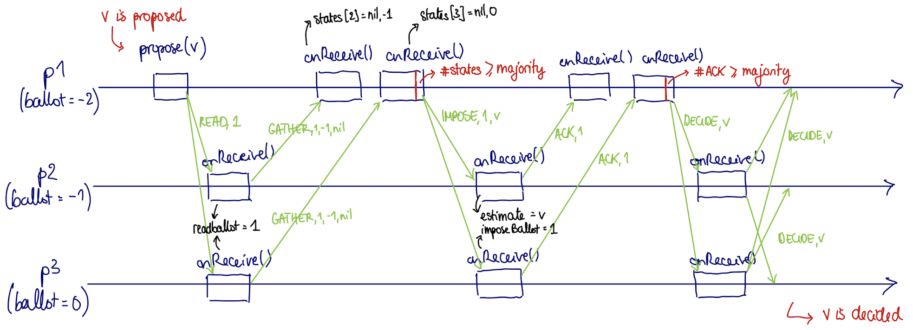

# Obstruction-Free Consensus and Paxos - SLR210

## Table of Contents
1. [Problem](#problem)
2. [Main idea of the algorithm](#idea)
3. [Implementation](#implementation)
4. [Performance](#performance)

## Problem
The goal of this project is to replicate the operations of a state machine using a message-passing system.
In order to do so, we need to solve consensus. The CAP theorem ensures that : *consensus is impossible to solve in an asynchronous message-passing system if at least one process may crash*. We therefore need to find a less strict form of consensus that is achievable.
This is the Paxos/Synod algorithm, which combines:
* **Obstruction-Free Consensus** (*ofcons*)  
  * Same Validity and Agreement as consensus,
  * Termination:
    * If a correct process p proposes, it eventually decides or aborts,
    * If a correct process decides, no correct process aborts infinitely often,
    * If there is a time after which a single correct process p proposes a value sufficiently many times, p eventually decides,

and
* an **Oracle** :
  * Eventual leader failure detector,
  * Outputs (at every process) a process identifier (a leader),
  * Eventually, the same correct process is output at every correct process.

The caveat is that for the Oracle to function, the system needs to be eventually synchronous, meaning that after a certain amount of time, the communication delay will be bounded, this is what allows Paxos to solve consensus without violating the CAP theorem.

## Main idea of the algorithm<a name="idea"/>

This project is an implementation of the **Synod Obstruction-Free Consensus**. This algorithm tries to reach a consensus, to eventually decide 0 or 1.
The main idea of this algorithm is to reach consensus in two parts:
* A proposing process first wants to be “heard” by a majority of processes. It proposes and then waits to receive a majority of *GATHER* messages. If it receives this majority of *GATHER* acknowledgments, this means that a majority of processes are listening to him and waiting for his value. As a set can’t contain two distinct majorities, only one proposal can receive a majority of *GATHER* messages without aborting.
* When being heard by a majority of processes, a proposing process wants to impose its value. It will send its value to everyone and will wait for a majority of ACK messages. If it is the case, then the process will finally *DECIDE* his value, and inform all other processes that he decided. All other processes will decide on the same value, ultimately reaching consensus.

We know that the Obstruction-Free Consensus alone does not have the strong termination property of consensus, so if everyone keeps proposing, it could never terminate. However, Obstruction-Free Consensus has the following termination property : *If there is a time after which a single correct process p proposes a value sufficiently many times, p eventually decides*.
This is why in Synod, an oracle is eventually electing a correct leader after a certain time.

## Implementation

The code is separated into three different parts:

* The main class (`Main.java`), that initiates the Akka system, and sends some references and initial messages to the actors.
* The actor, or process class (`Process.java`), that represents an Akka actor, which is like a thread with its own local memory, that can communicate with others only using message-passing. The actor has a method `onReceive()` in which we can choose how it reacts to a new message. Each process knows the references of all others: they are saved in an instance of the class `Members.java`.
* The message classes (`AbortMsg.java`, `AckMsg.java`, `CrashMsg.java`, `DecideMsg.java`, `GatherMsg.java`, `HoldMsg.java`, `ImposeMsg.java`, `LaunchMsg.java`, `OfconsProposerMsg.java`, `ReadMsg.java`), that are the different types of messages sent between the actors. An actor can distinguish messages in its `onReceive()` method using: 
 `if (message instanceof ...Msg)`. 
We also have a message type to start the time (`StartTime.java`), which we use here for benchmarking.

## Performance
We studied the performance of this algorithm by varying the number of processes from 3 to 10 to 100, the number of faulty processes from 1 to 4 to 49, and varying the hold delay in the range (0.5s, 1s, 1.5s, 2s).

The consensus takes much longer for N=100 than for the previous values.
Our explanation is that for N=100, there are so much messages transiting and queueing for each process that when the leader is elected, no process can act on it, and the consensus is delayed. There may be many *propose* operations at the same time even though a leader was elected.
To solve this, we decided to put a timeout between the reception of an abort message and the start of a new proposal. Thus, the number of queued messages waiting is lower, and the consensus is achieved much sooner.
